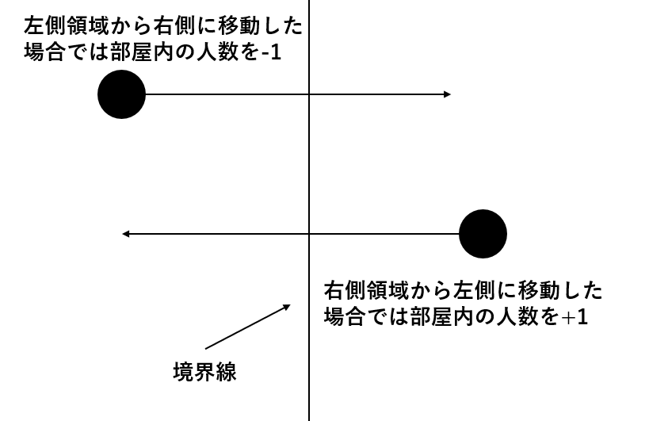
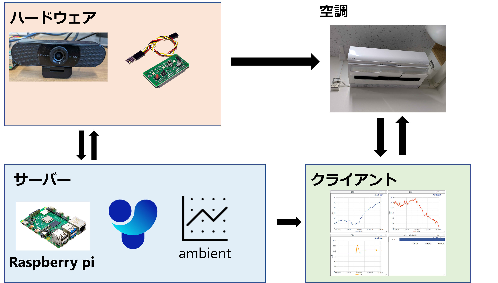
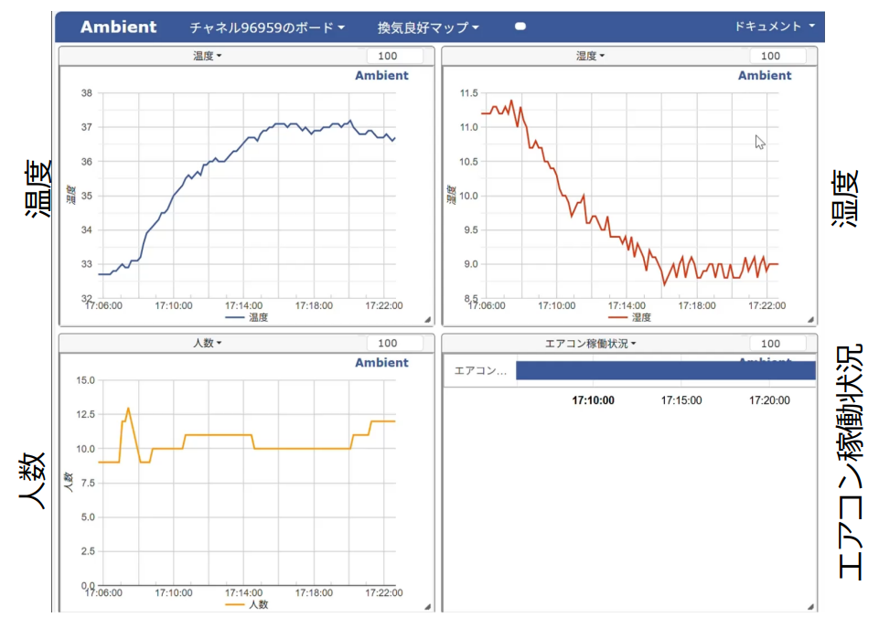

# ラズベリーパイを用いた室内環境モニタリングシステム    
本リポジトリは, 筆者が静岡大学情報学部の「先端情報学実習」というプロジェクトにおいて作成したシステムです. 

このシステムでは, 研究室内の人数, 温度, 湿度といった情報を, ラズベリーパイというマイコンを動作させることにより取得し, それらの情報をambientというサイトを通じて外部環境からの可視化を可能としたものです. 

また, 決定ベース的でありますが, 環境情報に応じたエアコン自動操作についても実装を行っております. 

人数の検出方法は, YOLOという物体検知モジュールを用いて, 人物がカメラの左側/右側領域から逆の領域に移動したことを確認できた場合に, 人数の増減を行うことにより実施しています. 



温度や湿度情報については, ラズベリーパイの拡張モジュールを通じて取得しました. 

本プロジェクトは, 2026年1月27日に, 浜松市で開催された, 「わかりやすいIoTを用いた現場実装講座」で発表を行いました. 

## 実行方法・環境インストール方法など

install ambient
```python
pip install git+https://github.com/AmbientDataInc/ambient-python-lib.git
```

program start
```
cd ./sentan
python -m send_data.send_data
python -m send_infrared
python -m get_people.track
```

## 使用機材
- webカメラ1台
- ラズベリーパイ拡張モジュール
  - www.amazon.co.jp/dp/B0792C954T


## システム構成図


## 起動例
ambientでは, 以下のような形式で記録され, 閲覧を行うことができます. 



# 備忘録
## codes.jsonの位置について
./sentanでプログラムを起動する関係上, ./sentan直下に置けば大丈夫です. \
他に置くと怒られます. 